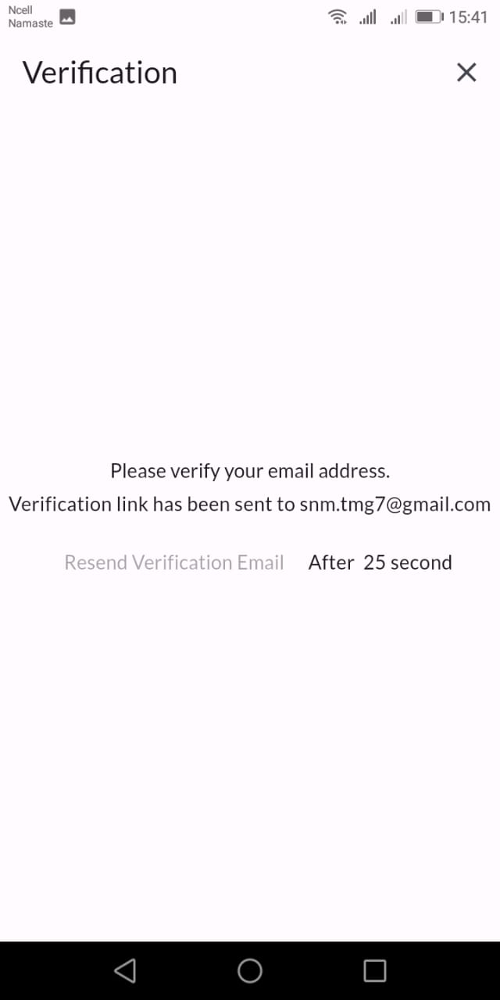

<h1>Diot App</h1>

Diot is a dynamic Flutter application that provides a comprehensive set of features for seamless user interaction and content sharing.

<h2>Features:</h2>

<h3>Sign Up / Sign In:</h3>

Effortlessly create and authenticate your account with a straightforward sign-up/sign-in process.

<h3>Show published article</h3>

.

  
<h3>User Profile:</h3>

View and personalize your user profile.

<h3>Chatting:</h3>

Foster real-time communication with other users.

<h3>Searching:</h3>

Efficiently search for articles and users.

<h3>Article Posting Field:</h3>

Create articles with a title and a rich text editor for detailed descriptions.

<h3>Follow/Unfollow:</h3>

Connect with other users through a simple follow/unfollow mechanism.

<h3>Like and Comment Article:</h3>

Engage with articles through likes and comments.

<h2>Getting Started:</h2>

<ol>
    <li>Clone the repository:
        <pre><code>git clone https://github.com/sanam-tamang/diot.git</code></pre>
    </li>
     <li>Download dependencies:
        <pre><code>flutter pub get</code></pre>
    </li>
      <li>Run Fluter app:
        <pre><code>Flutter run</code></pre>
    </li>

    
</ol>

 Alternative, you can directly download android app from  <a href="https://github.com/sanam-tamang/diot/blob/main/project_app/app-release.apk"> here </a> 

